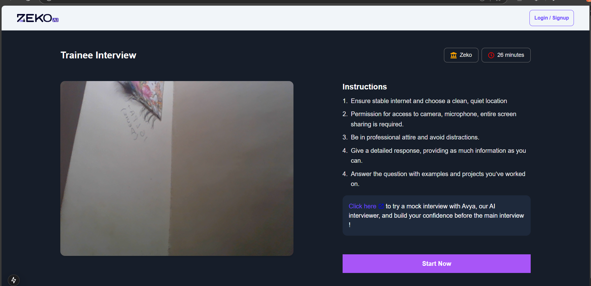
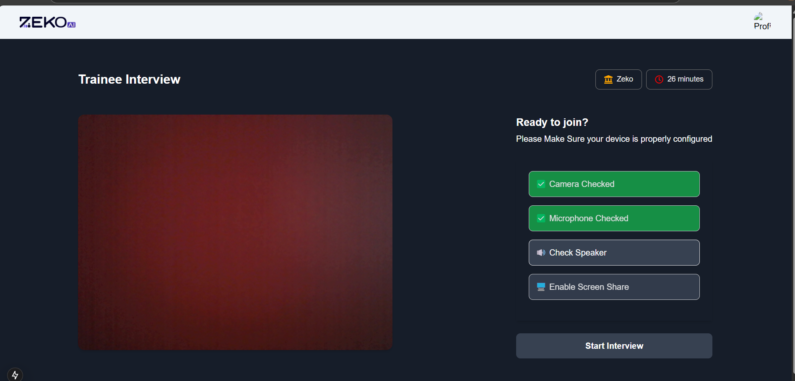

# AI-Interview Web App

AI-Interview is a modern web application designed to streamline the interview process using AI technologies. This app leverages a robust tech stack to provide a seamless experience for both interviewers and candidates.

---

## 🚀 Features
- **AI-Powered Interview Assistance**: Utilize AI to generate and analyze interview questions and responses.
- **Responsive Design**: Fully responsive UI built with TailwindCSS.
- **Real-time Communication**: Interactive and real-time feedback during interviews.
- **Google Generative AI Integration**: Enhances the app with generative AI capabilities.
- **Serverless Deployment**: Optimized for hosting on Netlify with Next.js.

---

## 🛠️ Tech Stack
### Core
- **Next.js 15**: Fast and scalable React framework.
- **React 19 (RC)**: Latest React features for improved performance.
- **TailwindCSS**: Utility-first CSS framework for fast UI development.

### AI
- **@google/generative-ai**: Powering AI-based functionalities.

### Utilities
- **Axios**: Promise-based HTTP client.
- **Formidable**: File upload and parsing.
- **clsx & class-variance-authority**: Utility libraries for conditional class management.
- **Lucide-react**: Icon library.

### Deployment
- **Netlify**: Serverless hosting and Next.js optimization via plugin.

---

## 📸 Screenshots

### 1. **Home Page**
The starting point for users, with clean navigation and a CTA to begin an interview.


### 2. **Permission**
Dynamic and real-time Permission page that asks for Camera, Mic and Screen Sharing permission for proctored Environment


### 3. **Start**
The follow up button for starting up the interview


### 4. **Interview with AI**
The Proctored Environment for Interview with the AI


### 5. **Follow Up Questions**
follow Up questions by the AI


---

## 🚀 Getting Started

### Prerequisites
- Node.js (v18 or above)
- npm or yarn package manager

### Installation
1. Clone the repository:
   ```bash
   git clone https://github.com/yourusername/ai-interview.git

2. Navigate to the project directory:
   ```bash
   cd ai-interview

3. Install dependencies:
   ```bash
   npm install

4. Development Server
    Start the development server:
   ```bash
   npm run dev

5. The app will be accessible at http://localhost:3000.

6. Build the app for production:
    ```bash
   npm run build

7. Start the production server:
    ```bash
   npm start
   
### 🛠️ Configuration

1. Environment Variables
    ```bash
    NEXT_PUBLIC_API_KEY=your-google-generative-ai-key

### 📝 Scripts
**npm run dev**: Start the development server with Turbopack.
**npm run build**: Build the app for production.
**npm run start**: Start the production server.
**npm run lint**: Run ESLint to check for code quality issues.

### 📂 Folder Structure
    ```bash
        ai-interview/
    ├── public/                # Static assets
    ├── src/app                # Application source code
    │   ├── components/        # Reusable React components
    │   ├── pages/             # Next.js pages
    │   ├── styles/            # Global and module-specific styles
    │   ├── utils/             # Utility functions
    │     
    ├── .env                   # Environment variables
    ├── package.json           # Project dependencies and scripts
    └── tailwind.config.js     # TailwindCSS configuration

----------------------------------


🌐 Deployment
1. The app is configured for deployment on Netlify. Install the Netlify CLI and use the following command:
    ```bash
    netlify deploy
